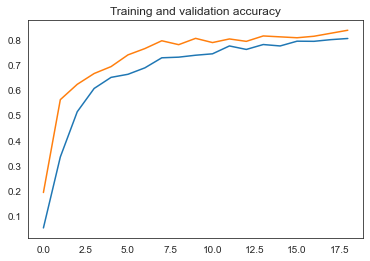
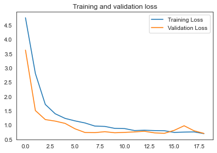
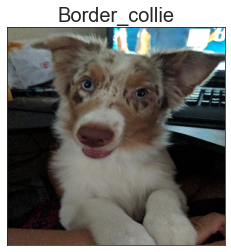
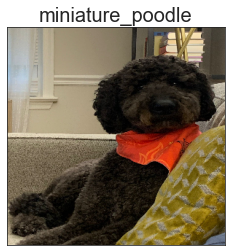

# Stanford-Dog-Dataset-Image-Classification

- Utilizing the Stanford Dog Dataset in conjunction with a Convolutional Neural Network, the final model was able to correctly label dog images 80% of the time into the correct breed classification.


**Data Scientist**: Anhduy (Andy) Nguyen

**Date**: July 13, 2022

## Repo Navigation

```
.
├── OldNotebooks
|   ├── AndyNotebook.ipynb
|   ├── AndyNotebook2.ipynb
|   ├── Pneumonia_img_classification.ipynb
|   ├── Pneumonia_img_classification2.ipynb
|   ├── bryan_final_working_notebook.ipynb
|   ├── bryan_other_w_notebook.ipynb
|   └── bryan_working_n_2.ipynb
├── img
│   ├── 2ndModel.png
│   ├── 3rdModel.png
│   ├── 4thModel.png
|   ├── applsci-08-01215-g001.webp
│   ├── BaseModel.png
|   ├── final_model_cnn.png
|   ├── logreg.png
│   ├── FinalModel.png
|   ├── model_1cnn.png
|   ├── model_2cnn.png
|   ├── PneumoniaImages.png
|   ├── PneumoniavsNonPneumonia.png
|   ├── Screenshot
|   ├── Screenshot
│   └── Screenshot
├── misc
|   ├── README.md.md
|   ├── README1.ipynb
|   └── README2.ipynb
├── .gitignore
├── Mint Simple Line Minimalist Medical Presentation.pdf
├── PneumoniaClassifcation.ipynb
└── README.md
```
## Table of Contents
- Links
- Business Understanding
- Business Problem
- Data Understanding
- Data Features
- Data
- Methodology & Results
- Conclusions
- Examples
- Limitations
- Next Steps
- Contact Info

## Links
- [Project Notebook](StanfordDogDataImageClassification.ipynb)
- [Presentation](DogClassificationPresentation.pdf)

## Business Understanding
The ASPCA has informed us that over 6.5 million animals are taken into US shelters annualy, which 3.3 million of those are dogs. Only around 50% of the sheltered animals are adopted, 20-30% of the remaining sheltered dogs are euthanized. 

## Business Problem
The task at hand is to build a image classification system utilizing pictures of 120 breeds of dogs to classify incoming strays into their breed category. This will help identify each incoming stray and decrease the workload on the volunteers and workers at animal shelters. By labeling each stray it will help potential adopters search for the specific dog breed they want or the ability to research the temperament and overall information about raising the specific dog breed before their adoption.

## Data Understanding
The data was retrieved from the Stanford Dog Dataset.  The data will not be available in this repository due to github repository size restriction, but can be downloaded from the link below. There are around 20580 images split into 120 different breeds. The images were precleaned only retaining adult image of dogs and only images that had a greater than 200 x 200 pixel size.

### Data Features
- 120 Breeds
- 20,580 Images

### Data
- [Stanford Dog Data](http://vision.stanford.edu/aditya86/ImageNetDogs/)
- [Kaggle](https://www.kaggle.com/datasets/jessicali9530/stanford-dogs-dataset)

## Methodology & Results
1. Imported Data and Utilized Data Augmentation
2. Base Model was a simple CNN utilizing Sparse Categorical Cross Entropy and an ADAM Optimizer
3. Our Second Model added Dropout
4. Third Model added Batch Normalization
5. Because of the poor performance of the first few models decided to add transfer learning InceptionV3
6. Although Scoring well on the test and train due to some labeling issues added another complete model
7. Final Model was the same as above with fix for the label mix up
8. Final Model scored 80% accuracy for train and validation and 70% for test accuracy

 

## Conclusions
- The best model was formed after research was done on how hard classifying 120 labels are by trying to do the iterative approach which didn't allow the model to score over a 20% on the accuracy score. By adding tranfer learning done with the InceptionV3 tranfer learning model the score was greatly increased to viable bounds. The final model itself performed very well having a 81% training accuracy, 82% Validation accuracy, and a 70% test accuracy score. The score itself may have increased if the model was allowed to run in totality instead of cancelling the training once the 80% training accuracy threshold was met. Ran some prediction on the Model with images outside of the dataset and it performed rather well.

## Examples
   

## Limitations
1. The amount of dog breeds was limited to the 120 breeds that were given in the data. The AKC currently classifies 197 dog breeds which mean currently the data is missing over 70+ dog breeds.
2. The data itself is quite old where the dataset was made back in 2011. Although the dataset was compiled in 2011 some of the images date even further back considering some of the items contained in the images and the image quality.
3. None of the images include any dogs in their puppy stages. All the images only included dogs that were of adult age.

## Next Steps
1. The first step would be add data on the remaining dog breeds that are missing to include the most inclusive training data set possible.
2. Break down the Dogs into percentage classification because more than likely dogs that end up a the shelter are mixed breeds. Having a percentage break down would be more useful than having a single classifier.
3. Try to tune this models to work with other species of animals such as cats and birds which are other animals that are surrendered to shelters.

## Contact Info
Email:
- [Anhduy Nguyen](anguyen61191@gmail.com)

GitHub:
- [Anhduy Nguyen](https://github.com/anguyen61191)

LinkedIn
- [Anhduy Nguyen](https://www.linkedin.com/in/anhduy-nguyen-217402149/)

## Disclaimer 
- All information and images used in this repository are for educational purposes only.  The logos and images rightfully belong to their owners.